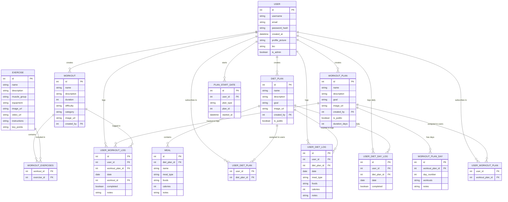

# Fitness Application ER Diagram

## Key Relationships:

1. **User Management**: Users can create workouts, diet plans, and workout plans
2. **Plan Subscriptions**: Users can subscribe to workout plans and diet plans
3. **Exercise Integration**: Workouts contain multiple exercises through the junction table
4. **Logging System**: Users can log their workout sessions and meal consumption
5. **Plan Structure**: Workout plans have multiple days, diet plans have multiple meals
6. **Progress Tracking**: Daily logs track completion status and detailed activity logs

## Notes:
- `WORKOUT_EXERCISES` is a many-to-many junction table between workouts and exercises
- `USER_WORKOUT_PLAN` and `USER_DIET_PLAN` are subscription tables
- `PLAN_START_DATE` tracks when users start following specific plans
- All user activities are logged with timestamps for progress tracking
